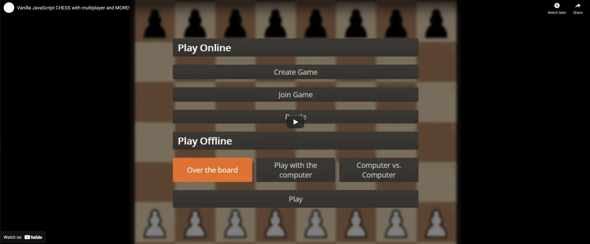

# Chess!

## Vanilla JS Chess with Stockfish and MULTIPLAYER!

[Click here to Play it!](https://chess.rodolfoi.tech/)
<br>
Made with vanilla JavaScript, using socket.io, Node JS, MySQL and [Stockfish.js](https://github.com/nmrugg/stockfish.js/).
<br>

## Summary
1. [Demo](#demo)
2. [Run locally](#run-locally)
3. [Rules](#rules)
4. [Draw](#draw)
5. [Game modes](#game-modes)
6. [Multiplayer](#multiplayer)
7. [Puzzles](#puzzles)
8. [Settings](#settings)
9. [Login and Register](#login-and-register)

### Demo:

[](https://youtu.be/3foDjZ4LCQM)

### Run locally:

- You can run it without Docker using node 16 (It **MUST** be 16) providing the environment variables in the `.env` file. But it is easier to run with the Dockerfile and docker compose:

1. Install Docker and Docker Compose.

2. Build the docker image:

```
docker build . -t chess
```

3. **__(IMPORTANT)__** Create the db folder:

```
mkdir db/data
```

4. Change the `docker-compose.yml` file:
* Lines 23 and 24 to use a valid outlook email and password.

```
EMAIL_USER: user@outlook.com #it must be an outlook email
EMAIL_PASS: password #the outlook email password
```

5. Run the container:
    1. Keep attached:
    ```
    docker compose up
    ```

    2. Run in background:
    ```
    docker compose up -d
    ```

6. Stop the container:

```
docker compose down
```

7. Now, if you want to update the running container just do (no need to execute the last steps anymore):

```
npm run deploy
```

* It will stop the container, rebuild the image and start the container again.

### Rules:

-   Pieces movement
-   Check and checkmate
-   En passant
-   Castling
-   Pawn promotion

#### Draw:

-   By repetition
-   Fifty move
-   Stalemate


### Game modes:

-   Play over the board
-   Play against the [Stockfish](https://github.com/nmrugg/stockfish.js/) Engine
-   Stockfish against itself
-   Create a MULTIPLAYER room to play with your friends!
    

### Multiplayer:

- Create and Join Multiplayer Games:


### Puzzles:

-   300,000 puzzles
-   Filter by rating and theme
    

### Settings:

-   Configure piece animation speed
-   Set the visibility of the moves indicators
-   Select between 26 board themes
-   Select between 22 pieces skins
    

### Login and Register:


